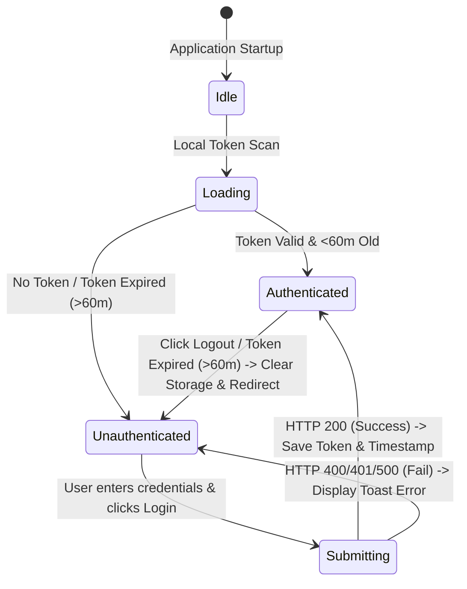

# Data Model: JWT Authentication Entity Mappings

This document defines the structured data representations and TypeScript definitions for user authentication entities, including validation rules and local session state transitions.

---

## 1. Entities & Types

### 1.1 User Profile Interface
Represents the authenticated user profile information returned by the API or decoded from the token.

```typescript
export interface User {
  id?: string;
  email: string;
  name: string;
  role?: string;
}
```

### 1.2 Auth Response Schema
Matches the expected JSON schema returned by the ASP.NET Core API on successful login (`POST /auth/login`).

```typescript
export interface AuthResponse {
  token: string;
  user: User;
}
```

### 1.3 Auth Session State
Represents the React global Context state for tracking authentication lifecycle.

```typescript
export interface AuthState {
  user: User | null;
  token: string | null;
  isAuthenticated: boolean;
  isLoading: boolean;
  error: string | null;
}
```

---

## 2. Validation & Formatting Rules

### 2.1 Email Field
* **Required**: Yes
* **Format**: Standard email pattern (`^[^\s@]+@[^\s@]+\.[^\s@]+$`)
* **Empty Error**: *"El correo electrónico es requerido."*
* **Format Error**: *"Por favor ingrese un correo electrónico válido."*

### 2.2 Password Field
* **Required**: Yes
* **Length**: Minimum 8 characters.
* **Complexity Rules**:
  - At least one uppercase letter (`[A-Z]`)
  - At least one lowercase letter (`[a-z]`)
  - At least one digit (`\d`)
  - At least one special character (`[@$!%*?&]`)
* **Validation Error**: *"La contraseña debe tener más de 8 caracteres, incluir mayúscula, minúscula, un número y un carácter especial."*

---

## 3. Session State Transitions

The application session transitions through the following state workflow:



### 3.1 Local Storage Schema
To ensure persistence across page refreshes and enforce the 60-minute expiration rule:

* `auth_token`: The raw JWT string (e.g., `eyJhbGciOi...`).
* `auth_user`: Stringified JSON representation of the `User` object.
* `auth_timestamp`: Milliseconds timestamp recorded at login (e.g., `1779836400000`).
