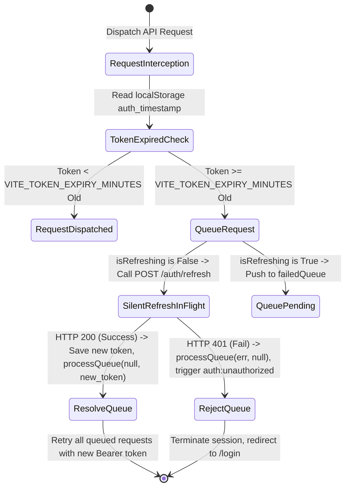

# Data Model: Token Refresh & Configuration Schema

This document details the data schemas and TypeScript interface extensions for the background token refresh mechanism.

---

## 1. Interface Extensions

### 1.1 Refresh Response payload
Matches the expected JSON response returned by the ASP.NET Core Backend on `POST /auth/refresh`.

```typescript
export interface RefreshResponse {
  accessToken: string;
}
```

### 1.2 Failed Queue Item
Internal type schema for holding pending requests in the Axios queue while a refresh is in progress.

```typescript
export interface FailedQueueItem {
  resolve: (token: string) => void;
  reject: (err: any) => void;
}
```

---

## 2. Dynamic Configurations

The token validity and refresh timing parameters are completely loaded from `.env.local` or environment variables:

| Variable Name | Type | Default Value | Description |
| :--- | :--- | :--- | :--- |
| `VITE_API_BASE_URL` | string | `http://localhost:5043/api` | The base HTTP endpoint targeting the ASP.NET Core API |
| `VITE_TOKEN_EXPIRY_MINUTES` | number | `60` | Duration of the access token's validity, used to trigger silent refreshes |

---

## 3. Interceptor Hook State Transitions

The Axios interceptor manages state transitions according to the following workflow:


