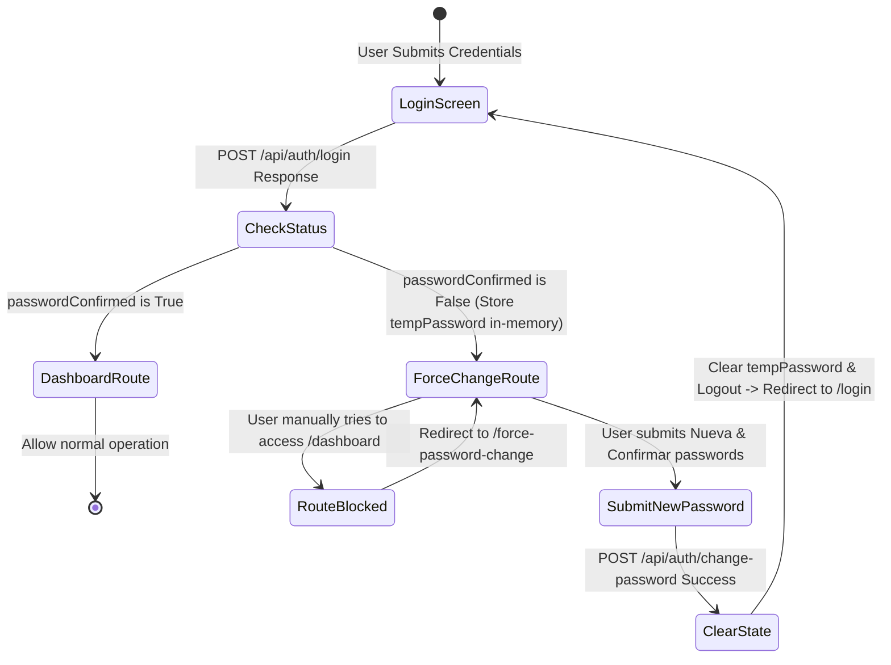

# Data Model: Force Password Change Interfaces

This document outlines the data model modifications and React routing state transitions.

---

## 1. Type Interfaces

### 1.1 Extended User Model
Matches the profile properties returned upon authentication.

```typescript
export interface User {
  id?: string;
  email: string;
  name: string;
  lastName?: string;
  passwordConfirmed?: boolean; // Indicates if first password change has been executed
}
```

### 1.2 Extended AuthResponse
Includes the new flag in the API response.

```typescript
export interface AuthResponse {
  token: string;
  refreshToken: string;
  email: string;
  name: string;
  lastName: string;
  passwordConfirmed?: boolean;
}
```

---

## 2. Page Navigation & Route Guard Transitions

The route guard intercepts user route transitions based on the following flow:


